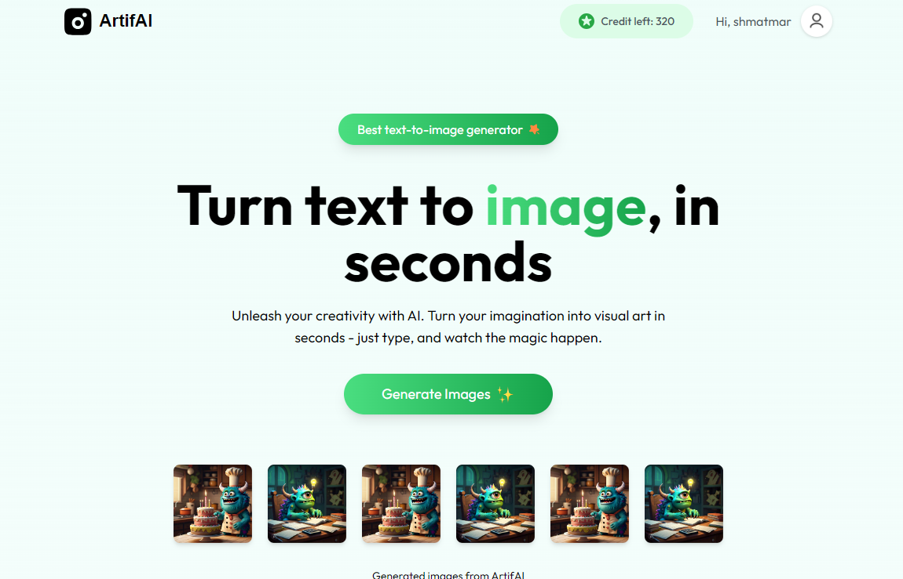
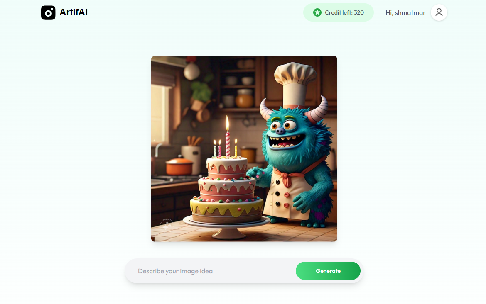

# ArtifAI - AI-Powered Text-to-Image Generator

ArtifAI is a web application that leverages AI to transform text prompts into visually stunning images within seconds. Whether you're a designer, marketer, or just someone with a creative spark, ArtifAI empowers you to turn imagination into reality. It's simple, fast, and designed for everyone.

---

## Features

### Text-to-Image Generation
- Users can input a text prompt, and the app generates high-quality images powered by cutting-edge AI technology.

### Account Management
- Users can register, log in, and manage their profiles.
- Credit-based usage ensures fairness and scalability.

### Credits System
- Each user starts with free credits.
- Additional credits can be purchased through a secure payment system.

### Responsive and Modern Design
- The application is fully responsive, ensuring an optimized user experience on both desktop and mobile devices.

### Payment Integration
- Payments for credits are handled, supporting popular payment methods like Visa, MasterCard, and PayPal.

---

## Technology Stack

- **Frontend:** React.js, TailwindCSS for styling, and Framer Motion for animations.
- **Backend:** Node.js with Express.js, secured using JWT for authentication.
- **Database:** MongoDB for storing user data and credits.
- **APIs:** Integrates with third-party AI services for image generation.

---

## Screenshots

### Header

### A page to generate images using prompts

### Response

### Credit System

### Payment Popup

### Login Popup

